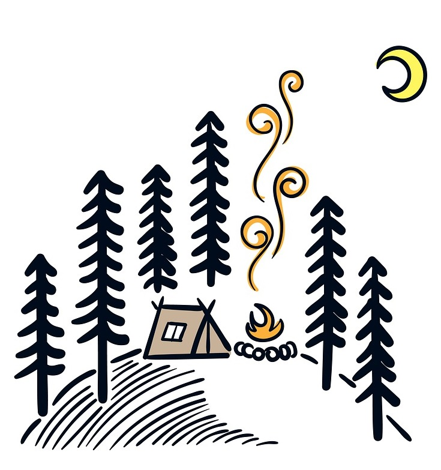

# Welcome!

<!-- 🌱 -->

This digital garden template is free, open-source, and [available on GitHub here](https://github.com/maximevaillancourt/digital-garden-jekyll-template).

The easiest way to get started is to read this [step-by-step guide explaining how to set this up from scratch](https://maximevaillancourt.com/blog/setting-up-your-own-digital-garden-with-jekyll). If you need any help, my [DMs are open on Twitter (@vaillancourtmax)](https://twitter.com/vaillancourtmax). Say hi! 👋

  Take a look at [[Your first note]] to get started on your exploration.

